# Agent Team Load Fix + SDLC Pipeline Map

Diagnostic report for `/Users/richardsongunde/projects/SDLC-rstack/`. Three deliverables: root-cause summary, the corrected configuration, and the SDLC Mermaid diagram.

## 1. Why the agent team failed to load

**Root cause (high confidence): 195 duplicate `name:` fields across the agents directory.**

`bin/sync-agents.sh` had been creating flat symlinks at `.claude/agents/<name>.md` pointing back to the canonical files in `core/`, `sdlc/`, and `specialists/<domain>/`. That worked for older Claude Code versions which only scanned the flat root. Claude Code 2.x and the Agent SDK in 2026 scan `.claude/agents/` *recursively*, so the registry saw both the symlink at `agents/orchestrator.md` and the real file at `agents/core/orchestrator.md` — both declaring `name: orchestrator`. The same collision happened for all 195 agents. The team load aborts because the SDK can't deterministically resolve which file owns each name.

This pattern is documented in [Issue #20931](https://github.com/anthropics/claude-code/issues/20931) (custom agents in nested directories not loading as expected) and [Issue #8501](https://github.com/anthropics/claude-code/issues/8501) (frontmatter ambiguity around required fields), and is a known failure mode for projects that mirror agents into a flat directory.

**Three secondary issues** that would have surfaced as warnings or partial failures even after the primary fix:

The `PreToolUse` hook block in `settings.json` was missing the required `matcher` field. PostToolUse had `"matcher": "Write|Edit"` correctly, but PreToolUse silently registered with no matcher, which stricter SDK versions reject during validation.

Agent-team display was configured via the legacy `preferences.tmuxSplitPanes: true`. The current documented field is `teammateMode` at the top level of `settings.json`, with values `"auto"` (default), `"in-process"`, or `"tmux"`. Per the [Claude Code agent-teams docs](https://code.claude.com/docs/en/agent-teams), the legacy preferences path is no longer honored.

Twelve agent files declared `color: white`. The supported palette is `blue`, `cyan`, `green`, `yellow`, `magenta`, `red`, `purple`, `orange`, `pink` ([Issue #19292](https://github.com/anthropics/claude-code/issues/19292) tracks the docs gap on color values). `white` is rejected as invalid and the agent definition is dropped.

Plus one cosmetic: `settings.json` had `"agent": "orchestrator"` at the top level — an undocumented key that current versions ignore. Migrated it to `defaultAgent` which is documented.

## Steps taken (already applied to your files)

The fixes were applied directly to `/Users/richardsongunde/projects/SDLC-rstack/.claude/`. Here is what changed:

The 195 flat symlinks under `agents/` were removed. The nested directories (`core/`, `sdlc/`, `specialists/`) are now the single source of truth and load directly via the SDK's recursive scan.

`settings.json` was patched in place: `teammateMode: "auto"` added at top level, `"matcher": "*"` added to the `PreToolUse` hook block, the undocumented `agent` key renamed to `defaultAgent`, and the legacy `preferences.tmuxSplitPanes` removed.

Twelve agent files (10 in `agents/specialists/product/` plus `agents/sdlc/10-summary.md` and `agents/sdlc/14-cost-estimation.md`) had `color: white` rewritten to `color: cyan`.

`bin/sync-agents.sh` was replaced with a no-op that prints an explanation. If you re-run the old version, it would re-create the symlinks and re-introduce the collision — the new version refuses to do that.

Final verification confirmed every fix held: 0 flat `.md` files at the agents root, 195 unique names across the nested tree, hook config valid, color palette inside the supported set.

## 2. Corrected configuration

### `settings.json` — full corrected file

```json
{
  "env": {
    "CLAUDE_CODE_EXPERIMENTAL_AGENT_TEAMS": "1",
    "CLAUDE_CODE_DISABLE_NONESSENTIAL_TRAFFIC": "1"
  },
  "permissions": {
    "allow": [
      "Bash(gh pr:*)"
    ]
  },
  "hooks": {
    "PreToolUse": [
      {
        "matcher": "*",
        "hooks": [
          {
            "type": "command",
            "command": "uv run $CLAUDE_PROJECT_DIR/.claude/hooks/scripts/pre_tool_use.py"
          }
        ]
      }
    ],
    "PostToolUse": [
      {
        "matcher": "Write|Edit",
        "hooks": [
          {
            "type": "command",
            "command": "uv run $CLAUDE_PROJECT_DIR/.claude/hooks/scripts/post_tool_use.py"
          },
          {
            "type": "command",
            "command": "uv run $CLAUDE_PROJECT_DIR/.claude/hooks/validators/ruff_validator.py"
          },
          {
            "type": "command",
            "command": "uv run $CLAUDE_PROJECT_DIR/.claude/hooks/validators/ty_validator.py"
          }
        ]
      }
    ],
    "SessionStart": [
      {
        "hooks": [
          {
            "type": "command",
            "command": "uv run $CLAUDE_PROJECT_DIR/.claude/hooks/scripts/session_start.py"
          }
        ]
      }
    ],
    "SessionEnd": [
      {
        "hooks": [
          {
            "type": "command",
            "command": "uv run $CLAUDE_PROJECT_DIR/.claude/hooks/scripts/session_end.py"
          }
        ]
      }
    ],
    "SubagentStop": [
      {
        "hooks": [
          {
            "type": "command",
            "command": "uv run $CLAUDE_PROJECT_DIR/.claude/hooks/scripts/subagent_stop.py"
          }
        ]
      }
    ],
    "Stop": [
      {
        "hooks": [
          {
            "type": "command",
            "command": "uv run $CLAUDE_PROJECT_DIR/.claude/hooks/scripts/stop.py"
          }
        ]
      }
    ]
  },
  "enabledPlugins": {
    "frontend-design@claude-plugins-official": true,
    "context7@claude-plugins-official": true,
    "code-review@claude-plugins-official": true,
    "github@claude-plugins-official": true,
    "superpowers@claude-plugins-official": true,
    "feature-dev@claude-plugins-official": true,
    "ralph-loop@claude-plugins-official": true,
    "pr-review-toolkit@claude-plugins-official": true,
    "commit-commands@claude-plugins-official": true
  },
  "teammateMode": "auto",
  "defaultAgent": "orchestrator"
}
```

### `bin/sync-agents.sh` — replaced with a no-op

```bash
#!/usr/bin/env bash
# sync-agents.sh — DISABLED.
#
# Previously: this script created flat symlinks at .claude/agents/*.md
# pointing at the nested files under core/, sdlc/, specialists/.
#
# Why it was disabled (2026-05-10):
#   Claude Code 2.x and the Agent SDK scan .claude/agents/ recursively.
#   Having both flat symlinks AND nested real files caused 195 duplicate
#   `name:` collisions, which prevented the agent team from loading.
#
# The nested directory structure (core/, sdlc/, specialists/<domain>/) is now
# the single source of truth and is loaded directly by the SDK.
#
# If you re-add the symlinks, the team load will break again.

echo "sync-agents.sh is disabled. The SDK loads .claude/agents/ recursively."
echo "No action taken."
exit 0
```

### Bulk patch applied to 12 agent files

```bash
# What was run
sed -i 's/^color: white/color: cyan/' \
  .claude/agents/specialists/product/*.md \
  .claude/agents/sdlc/10-summary.md \
  .claude/agents/sdlc/14-cost-estimation.md
```

### Verification command (run this anytime to confirm the fix is still in place)

```bash
cd /Users/richardsongunde/projects/SDLC-rstack/.claude && python3 - <<'PY'
import json
from pathlib import Path
import subprocess

# 1. No flat agent files at agents/ root
flat = list(Path("agents").glob("*.md"))
assert not flat, f"Flat agent files reappeared: {flat}"

# 2. No duplicate name: fields
names = []
for f in Path("agents").rglob("*.md"):
    for line in f.read_text().splitlines()[:20]:
        if line.startswith("name:"):
            names.append(line.split(":", 1)[1].strip())
            break
dupes = sorted({n for n in names if names.count(n) > 1})
assert not dupes, f"Duplicate names: {dupes}"

# 3. settings.json has the right shape
s = json.loads(Path("settings.json").read_text())
assert s.get("teammateMode") == "auto"
assert s.get("defaultAgent") == "orchestrator"
assert "agent" not in s
assert all("matcher" in c for c in s["hooks"]["PreToolUse"])

# 4. Color palette is supported
out = subprocess.run(["grep", "-rh", "^color:", "agents/"], capture_output=True, text=True).stdout
colors = {line.split(":",1)[1].strip() for line in out.splitlines()}
ok = {"blue","cyan","green","yellow","magenta","red","purple","orange","pink"}
assert colors <= ok, f"Unsupported colors: {colors - ok}"

print(f"OK — {len(names)} agents loaded cleanly, {len(colors)} colors in palette: {sorted(colors)}")
PY
```

## 3. SDLC pipeline Mermaid diagram

The full Mermaid source is also saved standalone at `SDLC-PIPELINE.mmd` in this repo. Paste it into Excalidraw via **Insert → Mermaid Diagram**. Each `subgraph` becomes a draggable frame.

```mermaid
flowchart TD

    subgraph T0["TRIGGER"]
        USR["Developer / PM<br/>provides transcript or brief"]
        ORC["orchestrator<br/>(opus, team lead)"]
        USR -- "/cook · /plan · /build" --> ORC
    end

    subgraph P1["PHASE 1 &middot; DISCOVERY"]
        S00["00 environment<br/>detect tools, env vars<br/>(sonnet)"]
        S01["01 transcript<br/>structure raw input<br/>(sonnet)"]
        S00_OUT[("environment_report.json")]
        S01_OUT[("transcript.json")]
        S00 --> S00_OUT
        S01 --> S01_OUT
    end

    subgraph P2["PHASE 2 &middot; REQUIREMENTS"]
        S02["02 requirements<br/>functional + non-functional<br/>user stories &middot; out-of-scope<br/>(sonnet)"]
        S02_OUT[("requirement_spec.json")]
        S02_SK["skill: plan-eng-review"]
        S02 --> S02_OUT
        S02 -. "loads" .-> S02_SK
    end

    subgraph P3["PHASE 3 &middot; DOCS + PLANNING (parallel)"]
        S03["03 documentation<br/>user docs structure<br/>(sonnet)"]
        S04["04 planning<br/>sprint breakdown &middot; capacity<br/>(opus)"]
        S03_OUT[("documentation.json")]
        S04_OUT[("plan.json")]
        S04_SK["skills: plan-ceo-review<br/>plan-eng-review"]
        S03 --> S03_OUT
        S04 --> S04_OUT
        S04 -. "loads" .-> S04_SK
    end

    subgraph P4["PHASE 4 &middot; DESIGN (Jira + Architecture)"]
        S05["05 jira<br/>Epic &rarr; Story &rarr; Task<br/>(sonnet)"]
        S06["06 architecture<br/>tech stack &middot; schema<br/>API contracts &middot; auth<br/>(opus)"]
        S05_OUT[("jira_tickets.json")]
        S06_OUT[("system_design.json<br/>+ HLD.md")]
        S05_EXT{{"Jira Cloud REST<br/>or GitHub Issues"}}
        S06_SK["skills: plan-eng-review<br/>security-owasp"]
        S05 --> S05_OUT
        S05 -.-> S05_EXT
        S06 --> S06_OUT
        S06 -. "loads" .-> S06_SK
    end

    subgraph P5["PHASE 5 &middot; SECURITY (optional)"]
        S12["12 security-threat-model<br/>STRIDE &middot; OWASP<br/>(opus)"]
        S12_OUT[("threat_model.json")]
        S12 --> S12_OUT
    end

    subgraph P6["PHASE 6 &middot; CODE"]
        S07["07 code<br/>scaffold &middot; implement<br/>verify health endpoint<br/>(opus)"]
        S07_OUT[("code_report.json<br/>+ source tree")]
        S07_BLD["builder<br/>(executes via skills)"]
        S07_PLG["plugin: backend-development<br/>(or domain-specific pack)"]
        S07_VLD["validator<br/>(read-only verify)"]
        S07_SK["skills: investigate &middot; careful"]
        S07 --> S07_BLD
        S07_BLD -. "loads" .-> S07_SK
        S07_BLD -. "loads pack" .-> S07_PLG
        S07_BLD --> S07_OUT
        S07_OUT --> S07_VLD
    end

    subgraph P7["PHASE 7 &middot; TEST + COMPLIANCE"]
        S08["08 testing<br/>unit + integration + e2e<br/>(sonnet)"]
        S13["13 compliance-checker<br/>regulated-domain audit<br/>(sonnet)"]
        S08_OUT[("test_report.json")]
        S13_OUT[("compliance_report.json")]
        S08_SK["skills: qa-testing<br/>webapp-testing"]
        S08 --> S08_OUT
        S08 -. "loads" .-> S08_SK
        S13 --> S13_OUT
    end

    subgraph P8["PHASE 8 &middot; DEPLOY"]
        S09["09 deployment<br/>containerize &middot; CI/CD<br/>canary + rollback<br/>(sonnet)"]
        S09_OUT[("deployment_report.json")]
        S09_SK["skills: ship<br/>setup-deploy &middot; canary"]
        S09_EXT{{"AWS / Azure / GCP<br/>GitHub Actions / GitLab<br/>Docker / K8s"}}
        S09 --> S09_OUT
        S09 -. "loads" .-> S09_SK
        S09 -.-> S09_EXT
    end

    subgraph P9["PHASE 9 &middot; DELIVERY"]
        S10["10 summary<br/>decision log &middot; risks<br/>(sonnet)"]
        S14["14 cost-estimation<br/>monthly run-rate<br/>(sonnet, optional)"]
        S11["11 feedback-loop<br/>retrospective<br/>(sonnet, optional)"]
        S10_OUT[("summary.json<br/>+ PROJECT_SUMMARY.md")]
        S14_OUT[("cost_estimate.json")]
        S11_OUT[("feedback.json")]
        S10 --> S10_OUT
        S14 --> S14_OUT
        S11 --> S11_OUT
        S10_OUT --> S14
        S14_OUT --> S11
    end

    subgraph X1["CROSS-CUTTING &middot; Hooks (Python uv)"]
        HK_PRE["pre_tool_use.py<br/>block rm -rf, .env"]
        HK_RUFF["ruff_validator.py"]
        HK_TY["ty_validator.py"]
        HK_CON["post_agent_contract_validator.py<br/>verifies JSON schema"]
    end

    subgraph X2["CROSS-CUTTING &middot; State Bus"]
        BUS[("outputs/team_state/<br/>JSON contracts<br/>file-based, replayable")]
    end

    subgraph X3["CROSS-CUTTING &middot; LLM Substrate"]
        LLM{{"Anthropic Claude API<br/>opus &middot; sonnet &middot; haiku"}}
    end

    ORC ==> P1
    P1 ==> P2
    P2 ==> P3
    P3 ==> P4
    P4 -.-> P5
    P4 ==> P6
    P5 -.-> P6
    P6 ==> P7
    P7 ==> P8
    P8 ==> P9

    S00_OUT --> BUS
    S01_OUT --> BUS
    S02_OUT --> BUS
    S03_OUT --> BUS
    S04_OUT --> BUS
    S05_OUT --> BUS
    S06_OUT --> BUS
    S07_OUT --> BUS
    S08_OUT --> BUS
    S09_OUT --> BUS
    S10_OUT --> BUS
    S11_OUT --> BUS
    S12_OUT --> BUS
    S13_OUT --> BUS
    S14_OUT --> BUS

    S07_BLD -. "PostToolUse Write/Edit" .-> HK_RUFF
    S07_BLD -. "PostToolUse Write/Edit" .-> HK_TY
    S07_BLD -. "PreToolUse" .-> HK_PRE
    S07_VLD -. "SessionEnd" .-> HK_CON

    P1 -. "model calls" .-> LLM
    P2 -. "model calls" .-> LLM
    P3 -. "model calls" .-> LLM
    P4 -. "model calls" .-> LLM
    P5 -. "model calls" .-> LLM
    P6 -. "model calls" .-> LLM
    P7 -. "model calls" .-> LLM
    P8 -. "model calls" .-> LLM
    P9 -. "model calls" .-> LLM

    classDef trigger    fill:#FFF4E6,stroke:#E07A1F,stroke-width:2px,color:#1F1F1F
    classDef discovery  fill:#E6F4FF,stroke:#1F6FE0,stroke-width:2px,color:#1F1F1F
    classDef require    fill:#E6FFFA,stroke:#00897B,stroke-width:2px,color:#1F1F1F
    classDef design     fill:#F3E6FF,stroke:#7B1FA2,stroke-width:2px,color:#1F1F1F
    classDef security   fill:#FFE6E6,stroke:#C62828,stroke-width:2px,color:#1F1F1F
    classDef code       fill:#FFF9E6,stroke:#B8860B,stroke-width:2px,color:#1F1F1F
    classDef test       fill:#E6FFE9,stroke:#2E7D32,stroke-width:2px,color:#1F1F1F
    classDef deploy     fill:#FFEBE6,stroke:#D84315,stroke-width:2px,color:#1F1F1F
    classDef deliver    fill:#FAFAFA,stroke:#000,stroke-width:2px,color:#1F1F1F
    classDef state      fill:#FFFFFF,stroke:#000,stroke-width:2.5px,color:#1F1F1F
    classDef hook       fill:#FFEBE6,stroke:#D84315,stroke-width:1.5px,color:#1F1F1F
    classDef ext        fill:#FFFFFF,stroke:#000,stroke-width:2px,stroke-dasharray:5 4,color:#1F1F1F
    classDef skill      fill:#FFE6F0,stroke:#C2185B,stroke-width:1.5px,color:#1F1F1F

    class USR,ORC trigger
    class S00,S01,S00_OUT,S01_OUT discovery
    class S02,S02_OUT require
    class S03,S04,S03_OUT,S04_OUT,S05,S06,S05_OUT,S06_OUT design
    class S12,S12_OUT security
    class S07,S07_BLD,S07_VLD,S07_OUT code
    class S08,S13,S08_OUT,S13_OUT test
    class S09,S09_OUT deploy
    class S10,S11,S14,S10_OUT,S11_OUT,S14_OUT deliver
    class BUS state
    class HK_PRE,HK_RUFF,HK_TY,HK_CON hook
    class S05_EXT,S09_EXT,LLM ext
    class S02_SK,S04_SK,S06_SK,S07_SK,S07_PLG,S08_SK,S09_SK skill
```



## How to import into Excalidraw

Open Excalidraw (web or desktop). Use **Insert → Mermaid Diagram** (or the `+` icon, then Mermaid). Paste the contents of `SDLC-PIPELINE.mmd`. Each phase becomes a labeled subgraph frame you can drag, resize, and recolor independently. The state bus, hooks, and LLM substrate render as cross-cutting cards beside the main pipeline so you can move them anywhere on the canvas without breaking the phase layout.

## Sources

- [Troubleshooting — Claude Code Docs](https://code.claude.com/docs/en/troubleshooting)
- [Create custom subagents — Claude Code Docs](https://code.claude.com/docs/en/sub-agents)
- [Orchestrate teams of Claude Code sessions — Claude Code Docs](https://code.claude.com/docs/en/agent-teams)
- [Subagents in the SDK — Claude API Docs](https://platform.claude.com/docs/en/agent-sdk/subagents)
- [Issue #20931: Custom Agents in `~/.claude/agents/` Not Loaded as Task Subagent Types](https://github.com/anthropics/claude-code/issues/20931)
- [Issue #8501: Claude Code subagent YAML Frontmatter authoritative documentation](https://github.com/anthropics/claude-code/issues/8501)
- [Issue #19292: Add color field to sub-agents supported frontmatter fields](https://github.com/anthropics/claude-code/issues/19292)
- [Issue #18392: Hooks in agent frontmatter are not executed for subagents](https://github.com/anthropics/claude-code/issues/18392)
- [Issue #31977: In-process team agents lack the Agent tool](https://github.com/anthropics/claude-code/issues/31977)
- [Fix Common Claude Code Sub-Agent Setup Problems — Arsturn](https://www.arsturn.com/blog/fixing-common-claude-code-sub-agent-problems)
- [Claude Code Changelog 2026 — claudefa.st](https://claudefa.st/blog/guide/changelog)
