# rstack-agents — System Architecture

> Senior Architect's sweep of `SDLC-rstack`. Shows every layer from CLI entry down to external APIs, with the JSON contract bus that connects them.

## Architecture at a glance

`rstack-agents` is a **two-layer system** wearing one repo:

1. **A thin npm CLI shell** (`bin/`, `src/`, `tests/`) — Node 18+, ESM, four commands. Its only job is to scaffold and validate `.claude/`.
2. **A deep agent runtime** (`.claude/`) — 200+ specialist agents, 66 skills, 72 plugin packs, a Python hook system, and a 15-stage SDLC pipeline. This is the actual product. It runs *inside Claude Code*, not inside Node.

The CLI is the installer. The runtime is the application.

## The contract bus

Every agent communicates by writing JSON to `outputs/team_state/`. There is no message queue, no RPC layer, no shared memory — just files. Each SDLC stage reads the previous stage's JSON and writes its own. Builder writes `[task].json`; validator reads it and writes `[task]_validation.json`. This is the entire integration pattern, and it is deliberately deterministic and replayable.

## Specialist breakdown (177 domain agents)

| Domain   | Count | Examples                                                      |
|----------|------:|---------------------------------------------------------------|
| backend  | 49    | api-architect, golang-pro, python-pro, microservices-architect |
| devops   | 34    | cloud-architect, kubernetes-specialist, terraform-engineer   |
| product  | 19    | product-manager, scrum-master, ux-researcher                 |
| qa       | 18    | bounty-hunter, code-reviewer, e2e-runner                     |
| data     | 13    | ml-engineer, llm-architect, data-engineer                    |
| docs     | 13    | technical-writer, diagram-architect, api-documenter          |
| security | 11    | api-security-audit, penetration-tester, compliance-auditor   |
| frontend | 10    | shadcn-implementation-builder, premium-ux-designer           |
| crypto   | 10    | crypto-coin-analyzer, crypto-market-agent (haiku/sonnet/opus) |

## Hook system (Python, `uv run`)

`settings.json` registers hooks against Claude Code lifecycle events (`PreToolUse`, `PostToolUse`, `SessionStart`, `SessionEnd`, `SubagentStop`, `Stop`). Only `builder` and `validator` agents trigger most of these. Categories live in `hooks/security/`, `hooks/code-quality/`, `hooks/devops/`, and `hooks/quality-gates/`.

## External boundary

| Stage / component        | Talks to                                          |
|--------------------------|---------------------------------------------------|
| every agent              | Anthropic Claude API (opus / sonnet / haiku)      |
| `05-jira`                | Jira Cloud REST or GitHub Issues fallback         |
| `06-architecture`        | DB engine choice (Postgres / MySQL / SQLite / Mongo) |
| `09-deployment`          | AWS / Azure / GCP, GitHub Actions / GitLab / Jenkins, Docker / K8s |
| `payment-processing` plugin | Stripe / PayPal                                |
| `.github/workflows/publish.yml` | npm registry                              |

---

## Mermaid flowchart

> Paste this block into Excalidraw via `+` → `Insert Mermaid Diagram`. The full standalone source is also available in [`ARCHITECTURE.mmd`](./ARCHITECTURE.mmd).

```mermaid
flowchart TD

    subgraph USER["USER ENTRY"]
        DEV["Developer in target project"]
        CC["Claude Code<br/>CLI / IDE"]
    end

    subgraph CLI["CLI &amp; Library Shell &middot; rstack-agents (npm)"]
        BIN["bin/rstack-agents.js<br/>commander entry"]
        IDX["src/index.js<br/>library exports"]
        subgraph CMDS["src/commands/"]
            INIT["init.js"]
            UPD["update.js"]
            LIST["list.js"]
            VAL["validate.js"]
        end
        subgraph UTL["src/utils/"]
            COPY["copy.js"]
            LOGGER["logger.js"]
        end
        SYNC["scripts/sync-templates.js"]
    end

    subgraph CFG["Configuration Layer &middot; .claude/"]
        SET["settings.json<br/>hooks + env + plugins<br/>default agent: orchestrator"]
        SETL["settings.local.json"]
        PIPE["sdlc-pipeline.yml<br/>DAG &amp; parallel phases"]
        DOCS_C["CLAUDE.md / AGENTS.md<br/>ETHOS.md / DESIGN.md"]
        VER["VERSION + CHANGELOG.md"]
    end

    subgraph CORE["Orchestration Core &middot; opus"]
        ORC["orchestrator.md<br/>routes &amp; decomposes"]
        BLD["builder.md<br/>executes ONE task"]
        VLD["validator.md<br/>read-only verify"]
    end

    subgraph SDLC["SDLC Pipeline &middot; 15 stages"]
        direction TB
        S00["00 environment"]
        S01["01 transcript"]
        S02["02 requirements"]
        S03["03 documentation"]
        S04["04 planning"]
        S05["05 jira"]
        S06["06 architecture"]
        S07["07 code"]
        S08["08 testing"]
        S09["09 deployment"]
        S10["10 summary"]
        S11["11 feedback-loop (opt)"]
        S12["12 security-threat-model (opt)"]
        S13["13 compliance-checker (opt)"]
        S14["14 cost-estimation (opt)"]
        S00 --> S01 --> S02 --> S03 --> S04 --> S05 --> S06 --> S07 --> S08 --> S09 --> S10
        S10 -.-> S11
        S06 -.-> S12
        S06 -.-> S13
        S04 -.-> S14
    end

    subgraph SPEC["Specialist Agents &middot; 177 total"]
        SP_BE["backend &middot; 49"]
        SP_FE["frontend &middot; 10"]
        SP_DO["devops &middot; 34"]
        SP_QA["qa &middot; 18"]
        SP_SE["security &middot; 11"]
        SP_DA["data &middot; 13"]
        SP_PR["product &middot; 19"]
        SP_DC["docs &middot; 13"]
        SP_CR["crypto &middot; 10"]
    end

    subgraph SK["Skills &middot; 66 templates"]
        SK_W["Workflow<br/>investigate, ship, qa-testing<br/>plan-eng-review, security-owasp"]
        SK_D["Development<br/>frontend-design, mcp-builder<br/>claude-api, webapp-testing"]
        SK_F["File<br/>pdf, docx, xlsx, pptx"]
        SK_C["Creative<br/>canvas-design, theme-factory<br/>algorithmic-art, excalidraw"]
    end

    subgraph PLG["Plugins &middot; 72 domain packs"]
        PL1["backend-development"]
        PL2["payment-processing<br/>Stripe / PayPal"]
        PL3["machine-learning-ops"]
        PL4["incident-response"]
        PL5["ui-design"]
        PL6["security-compliance<br/>kubernetes-operations<br/>cicd-automation"]
        PLN["...66 more"]
    end

    subgraph HK["Hook System &middot; Python (uv)"]
        subgraph HK_S["scripts/"]
            HK_PRE["pre_tool_use.py<br/>block rm -rf, .env"]
            HK_POST["post_tool_use.py"]
            HK_SS["session_start.py"]
            HK_SE["session_end.py"]
            HK_SUB["subagent_stop.py / stop.py"]
            HK_HND["pre_handoff_checker.py"]
        end
        subgraph HK_V["validators/"]
            VV_R["ruff_validator.py"]
            VV_T["ty_validator.py"]
            VV_C["post_agent_contract_validator.py"]
        end
        subgraph HK_C["category configs"]
            HC_SEC["security/<br/>dangerous-cmd, secret-scanner"]
            HC_CQ["code-quality/<br/>lint-on-save"]
            HC_DV["devops/<br/>conventional-commits<br/>prevent-direct-push"]
            HC_QG["quality-gates/<br/>tdd-gate, scope-guard<br/>plan-gate"]
        end
    end

    subgraph STATE["State Bus &middot; outputs/team_state/"]
        ST_B[("builder JSON<br/>files_modified<br/>tests_run &middot; status")]
        ST_V[("validator JSON<br/>checks &middot; status<br/>issues")]
        ST_S[("SDLC stage JSONs<br/>requirement_spec, plan<br/>system_design, code_report<br/>test_report, deployment_report")]
        ST_D["HLD.md<br/>PROJECT_SUMMARY.md"]
    end

    subgraph CIB["Tests &amp; CI / Release"]
        TS1["tests/validate-agents.test.js"]
        TS2["tests/validate-hooks.test.js"]
        GH1[".github/workflows/ci.yml"]
        GH2[".github/workflows/validate-agents.yml"]
        GH3[".github/workflows/publish.yml"]
    end

    subgraph EXT["External APIs / Services"]
        EX_AN["Anthropic Claude API<br/>opus / sonnet / haiku"]
        EX_JR["Jira Cloud or GitHub Issues"]
        EX_CL["Cloud: AWS / Azure / GCP"]
        EX_CI["CI/CD: GH Actions / GitLab / Jenkins"]
        EX_PY["Payments: Stripe / PayPal"]
        EX_NPM["npm registry"]
        EX_DB["DB: Postgres / MySQL / SQLite / Mongo"]
        EX_DK["Docker Compose / K8s"]
    end

    DEV --> CC
    DEV -- "rstack-agents init" --> BIN
    BIN --> CMDS
    IDX --> CMDS
    CMDS --> UTL
    SYNC -. "templates/ sync" .-> CMDS
    CMDS -- "scaffold / update" --> CFG

    CC -- "loads on session start" --> SET
    SET -- "registers hooks" --> HK
    SET -- "default agent" --> ORC
    PIPE -- "DAG &amp; phase groups" --> SDLC
    DOCS_C -- "routing rules" --> ORC

    ORC -- "delegates task" --> BLD
    ORC -- "starts pipeline" --> SDLC
    ORC -- "picks domain expert" --> SPEC
    BLD -- "loads relevant" --> SK
    BLD -- "loads domain pack" --> PLG
    SPEC -- "uses" --> SK

    BLD -- "writes" --> ST_B
    ST_B -- "trigger validate" --> VLD
    VLD -- "reads + checks" --> ST_B
    VLD -- "writes" --> ST_V
    ST_V -- "PASS / FAIL" --> ORC

    SDLC -- "each stage writes JSON" --> ST_S
    S06 -- "writes" --> ST_D
    S10 -- "writes" --> ST_D
    ST_S -- "next stage reads prior" --> SDLC

    BLD -- "PreToolUse" --> HK_PRE
    BLD -- "PostToolUse Write/Edit" --> HK_POST
    BLD -- "PostToolUse Write/Edit" --> VV_R
    BLD -- "PostToolUse Write/Edit" --> VV_T
    VLD -- "SessionEnd" --> VV_C
    CC -- "SessionStart" --> HK_SS
    CC -- "SessionEnd" --> HK_SE
    CC -- "SubagentStop / Stop" --> HK_SUB
    ORC -- "Pre-handoff" --> HK_HND

    S05 -- "REST or fallback" --> EX_JR
    S06 -- "schema choice" --> EX_DB
    S09 -- "deploy targets" --> EX_CL
    S09 -- "pipeline triggers" --> EX_CI
    S09 -- "containerize" --> EX_DK
    PL2 -- "billing flows" --> EX_PY
    GH3 -- "publishes" --> EX_NPM

    ORC -. "model calls" .-> EX_AN
    BLD -. "model calls" .-> EX_AN
    VLD -. "model calls" .-> EX_AN
    SDLC -. "model calls" .-> EX_AN
    SPEC -. "model calls" .-> EX_AN

    TS1 -- "frontmatter check" --> SPEC
    TS1 -- "frontmatter check" --> SDLC
    TS2 -- "hook reference check" --> HK
    GH1 -- "runs" --> TS1
    GH1 -- "runs" --> TS2
    GH2 -- "runs" --> VAL

    classDef user fill:#FFF4E6,stroke:#E07A1F,stroke-width:2px,color:#1F1F1F
    classDef cli fill:#E6F4FF,stroke:#1F6FE0,stroke-width:2px,color:#1F1F1F
    classDef cfg fill:#F0F0F0,stroke:#444,stroke-width:1.5px,color:#1F1F1F
    classDef core fill:#F3E6FF,stroke:#7B1FA2,stroke-width:2.5px,color:#1F1F1F
    classDef sdlc fill:#E6FFE9,stroke:#2E7D32,stroke-width:2px,color:#1F1F1F
    classDef spec fill:#FFF9E6,stroke:#B8860B,stroke-width:1.5px,color:#1F1F1F
    classDef skill fill:#FFE6F0,stroke:#C2185B,stroke-width:1.5px,color:#1F1F1F
    classDef plugin fill:#E6FFFA,stroke:#00897B,stroke-width:1.5px,color:#1F1F1F
    classDef hook fill:#FFEBE6,stroke:#D84315,stroke-width:1.5px,color:#1F1F1F
    classDef state fill:#FAFAFA,stroke:#000,stroke-width:2px,color:#1F1F1F
    classDef ci fill:#EDEDED,stroke:#555,stroke-width:1.5px,color:#1F1F1F
    classDef ext fill:#FFFFFF,stroke:#000,stroke-width:2px,stroke-dasharray:5 4,color:#1F1F1F

    class DEV,CC user
    class BIN,IDX,INIT,UPD,LIST,VAL,COPY,LOGGER,SYNC cli
    class SET,SETL,PIPE,DOCS_C,VER cfg
    class ORC,BLD,VLD core
    class S00,S01,S02,S03,S04,S05,S06,S07,S08,S09,S10,S11,S12,S13,S14 sdlc
    class SP_BE,SP_FE,SP_DO,SP_QA,SP_SE,SP_DA,SP_PR,SP_DC,SP_CR spec
    class SK_W,SK_D,SK_F,SK_C skill
    class PL1,PL2,PL3,PL4,PL5,PL6,PLN plugin
    class HK_PRE,HK_POST,HK_SS,HK_SE,HK_SUB,HK_HND,VV_R,VV_T,VV_C,HC_SEC,HC_CQ,HC_DV,HC_QG hook
    class ST_B,ST_V,ST_S,ST_D state
    class TS1,TS2,GH1,GH2,GH3 ci
    class EX_AN,EX_JR,EX_CL,EX_CI,EX_PY,EX_NPM,EX_DB,EX_DK ext
```

## How to import into Excalidraw

1. Open Excalidraw (web or desktop).
2. Click the menu → **Insert Mermaid diagram** (or `+` icon → Mermaid).
3. Paste the contents of `ARCHITECTURE.mmd`.
4. Click **Insert**. Excalidraw renders the layout, grouping each `subgraph` as a frame so you can drag layers around independently.

## Critical paths captured

- **Install / scaffold**: Developer → CLI → `init.js` → copies `.claude/` → reads `settings.json` → boots orchestrator on next Claude Code session.
- **Single task**: orchestrator → builder → writes JSON → validator → reads + validates → PASS/FAIL back to orchestrator.
- **Full SDLC**: orchestrator → 15 stages, each consuming the previous stage's JSON, writing its own. Hooks fire on every Write/Edit. Quality gates enforce coverage / vulnerability ceilings.
- **External egress**: Anthropic API (every agent), Jira (stage 05), cloud + CI/CD (stage 09), npm (publish workflow).
