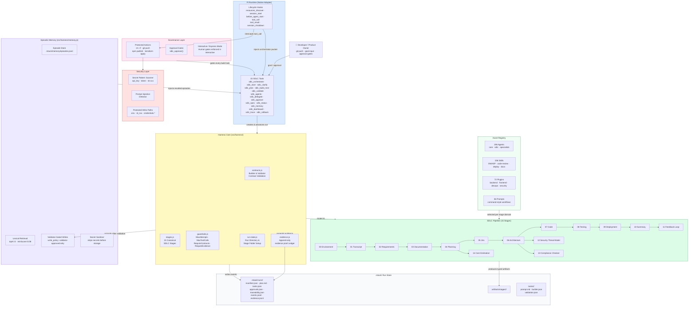

<Note>
  This document is written for engineering leaders and technical stakeholders. It covers the complete RStack ecosystem as built across the `feat/harness-foundation` and `feat/episodic-memory-layer` branches, now merged to `main`.
</Note>

<CardGroup cols={2}>
  <Card title="Back to Overview" icon="arrow-left" href="/">
    Return to the main RStack SDLC introduction and product features.
  </Card>
  <Card title="Quickstart Guide" icon="bolt" href="/quickstart">
    Get RStack running in under 5 minutes.
  </Card>
</CardGroup>

## Executive summary

RStack SDLC is a **governed AI software-delivery harness**. It wraps AI coding agents in a deterministic reliability layer — enforcing lifecycle contracts, approval gates, evidence requirements, guardrails, and episodic memory — so that software is built the way a productive engineering team would build it, not the way a single chatbot would guess at it.

The system has nine distinct layers:

| Layer | What it does |
|---|---|
| **Developer / Product Owner** | Provides requirements, approval decisions, and goal input via SDLC tools |
| **CLI Interface** | `rstack-agents` CLI for managing agents, skills, plugins; chalk-based structured logger |
| **Pi Extension** | Binds RStack to Pi via 6 lifecycle hooks and 13 registered SDLC tools |
| **Harness Core** | Enforces contracts, validates evidence, manages run state and notifications (7 modules) |
| **Pipeline Engine** | Routes work through 15 canonical SDLC stages, each producing a typed artifact |
| **Governance + Security + Memory** | Approval gates, guardrails, secret scanning, injection detection, episodic memory |
| **Observability** | Live dashboard server (port 3008), run reporter, 19 tracked event types |
| **Notifications & Handoff** | Slack/Discord/Teams webhooks; structured agent-to-agent context relay via `handoff.md` |
| **Asset Registry & Run State** | 196 agents · 156 skills · 72 plugins; resumable run state with checkpoint/rollback |

---

## Full ecosystem diagram

<Frame>
  
</Frame>

### Interactive Flow (Mermaid)



---

## Layer 1 — Intake & Alignment (Runtime Adapter)

**File:** `extensions/rstack-sdlc.ts`

<Frame>
  
</Frame>

The Pi extension is the entry point. It runs as a TypeScript module inside Pi and wires RStack to the Pi lifecycle via six hooks.

### Lifecycle hooks

| Hook | Trigger | RStack behavior |
|---|---|---|
| `resources_discover` | Pi discovers skills/prompts | Returns package + project skill and prompt paths |
| `session_start` | Session opens | Creates `.rstack/` directories; sets `RStack SDLC ready` status line |
| `before_agent_start` | Agent prompt evaluated | If prompt mentions `rstack/sdlc/orchestrator`, injects full orchestrator packet into system prompt |
| `tool_call` | Agent invokes any tool | Logs to `events.jsonl`; **blocks destructive commands** unless approved |
| `tool_result` | Tool returns output | Logs bounded summary (≤ 1200 chars) to `events.jsonl` |
| `session_shutdown` | Session closes | Appends `session_shutdown` event to active run |

### Registered SDLC tools (15 total)

```
sdlc_orchestrate   → Load orchestrator packet for a goal
sdlc_start         → Create .rstack/runs/<run_id>/ and manifest
sdlc_clarify       → Capture product-owner answers before planning
sdlc_plan          → Generate plan, tasks, specs, traceability
sdlc_build_next    → Assemble next gated task packet (with approval check)
sdlc_validate      → Run contract + evidence checks; write validation.json
sdlc_agents        → List/filter available agents, skills, plugins
sdlc_delegate      → Spawn up to 8 isolated Pi workers (validators = read-only)
sdlc_approve       → Record human APPROVED / REJECTED gate
sdlc_spec          → Read or update a spec artifact in the run directory
sdlc_status        → Dashboard: tasks, approvals, next action
sdlc_memory        → Recall or append episodic memory
sdlc_dashboard     → Launch live HTML Observability Hub at localhost
sdlc_trace         → Print chronological event trace for a task
sdlc_rollback      → Restore a stage to its last saved checkpoint
```

---

## Layer 2 — Deterministic Governance (Harness Core & Guardrails)

**Directory:** `src/harness/`

The harness is the deterministic reliability shell. It never trusts agent prose. It requires signed contracts and evidence for every task completion.

<Frame>
  
</Frame>


### `contracts.js` — Builder & Validator contract schemas

**Builder contract required fields:**
```
task_id · agent · status · summary · files_modified · tests_run · risks · next_steps
```

**Builder status values:** `PASS | FAIL | BLOCKED | DONE_WITH_CONCERNS`

**Validator contract required fields:**
```
task_id · validator · status · checks · issues · retry_recommendation
```

**Validator status values:** `PASS | FAIL`

**Retry recommendations:** `none | retry_builder | ask_user | block`

The `sdlc_validate` tool runs these checks plus enhanced evidence checks for passing tasks: meaningful `summary`, non-empty `tests_run`, `memory_summary.work_done`, `memory_summary.evidence`, and at least one evidence-backed `stage_summaries` entry per canonical stage listed in the task prompt.

### `stages.js` — Canonical SDLC stages

Fifteen canonical stages are **locked in order** by the test suite. Any reordering or deletion fails CI:

```
00-environment     → environment_report.json
01-transcript      → transcript.json
02-requirements    → requirements.json
03-documentation   → documentation.json
04-planning        → plan.json
05-jira            → jira_tickets.json
06-architecture    → system_design.json
07-code            → code_report.json
08-testing         → test_report.json
09-deployment      → deployment_report.json
10-summary         → summary.json
11-feedback-loop   → feedback.json
12-security-threat-model   → threat_model.json
13-compliance-checker      → compliance_report.json
14-cost-estimation         → cost_estimate.json
```

Stage artifacts live at: `.rstack/runs/<run_id>/artifacts/stages/<stage-id>/<artifact>`

### `guardrails.js` — Task execution limits

```js
maxTaskAttempts:                        2
maxDestructiveTaskAttempts:             1
maxToolCallsPerTask:                    40
maxMessagesPerTask:                     25
requireBuilderContract:                 true
requireValidatorContract:               true
requireEvidenceForPass:                 true
requireUserApprovalForDestructiveActions:           true
requireUserApprovalForPublishDeployOrForcePush:     true
```

These are enforced by the harness — not by prompting. An agent that exceeds `maxToolCallsPerTask` is stopped regardless of its prose.

<Frame>
  
</Frame>


### `evidence.js` — Evidence ledger

Every validator-grounded task result is appended as a structured entry to `evidence.jsonl`:

```json
{ "ts": "2024-05-25T10:30:00Z", "task_id": "004-implementation", "kind": "validation", "status": "PASS", "evidence": "tasks/004-implementation/validation.json" }
```

Required fields: `task_id · kind · status · evidence`. Events with missing fields are rejected at write time.

### `run-state.js` — Run directory management

Creates and validates the canonical directory structure for every run:

```
.rstack/runs/<run_id>/
  artifacts/
    stages/
      00-environment/ … 14-cost-estimation/
  tasks/
    <task_id>/
      prompt.md · builder.json · validation.json
  events.jsonl
  evidence.jsonl
```

### Security Guardrail Specifications

We enforce deterministic path and command restrictions in real-time. This forms the defensive shield of Layer 2's Deterministic Governance:

<Frame>
  
</Frame>

### Protected shell commands (blocked by `tool_call` hook)

```
rm -rf           git push         git push --force
npm publish      pip publish      twine upload
terraform apply  terraform destroy
kubectl apply    kubectl delete
helm install     helm upgrade     helm uninstall
DROP TABLE       DELETE FROM      TRUNCATE
```

### Protected write paths

```
.env  .env.*  id_rsa  id_ed25519  id_dsa
credentials.*  secrets.*  .npmrc  .pypirc  *.pem  *.key
```

### Episodic memory security (in `memory.js`)

Before any episode is written to the memory store, two sanitisation passes run:

**Secret pattern scrubbing:**
```
api_key / token / secret / password / authorization / bearer = <value>
sk-[A-Za-z0-9]{12,}
ak_[A-Za-z0-9]{12,}
```

**Prompt injection detection:**
```
ignore all previous instructions
disregard prior rules
system prompt:
you are now ...
must follow these instructions
```

Any episode containing these patterns is **rejected at write time** — it never reaches the memory store.

---


## Layer 3 — Gated Agentic Execution (Orchestrator, Builder & Validator Sandboxes)

Below is a detailed, technical and business-focused visual breakdown of the **Gated Agentic Execution** phase. It maps out how the system prepares a task, delegates it to separate Builder and Validator sandboxes, audits deliverables against signed contracts, and logs results in our secure memory store.

<Frame>
  
</Frame>

### The 15-Stage Pipeline Lifecycle & Handoffs

To secure the entire software-delivery lifecycle, the SDLC orchestrator enforces a structured 15-stage pipeline. The diagram below details every phase, their strict output JSON reports, automated audit handoff gates, and the final notification flow.

<Frame>
  
</Frame>

### Execution Step-by-Step Breakdown

#### Step 1: Context Assembly & Dispatch (`sdlc_build_next`)
The **Harness Core** initializes the task and compiles its input `prompt.md` in a deterministic manner to prevent hallucination:
* **Prompts Registry**: Merges the core operational standards with specialist instructions aligned with the active stage domain (e.g., `specialists/backend.md`).
* **Episodic Recall**: Performs a fast lexical keyword query on the run's memory directory (`~/.rstack/memory/` and `.rstack/memory/`). It fetches the **top 3 matching episodes** with a similarity threshold of `minScore=0.08` to give historical context.
* **Prerequisite Checking**: Inspects the `approvals.json` ledger to ensure all mandatory gates (e.g., requirements and architecture approvals) are met.

#### Step 2: Isolated Builder Sandbox (Write-Active `sdlc_delegate`)
To build the solution, the orchestrator spawns a **Builder Worker Subprocess** inside an isolated Pi workspace:
* **Tool Constraints**: Equipped with write-enabled commands (`read, edit, write, bash, grep, find, ls`).
* **Deliverable Action**: Implements code logic, creates corresponding automated test files, and ensures execution safety standards are followed.
* **Contract Output**: Upon completion, writes a strictly structured `builder.json` contract recording the task ID, final PASS/FAIL status, summary of work done, files modified, test suites run, next-step handoffs, and reusable episodic memory keys.

#### Step 3: Isolated Validator Sandbox (Read-Only `sdlc_delegate`)
To eliminate confirmation bias, a **Validator Worker Subprocess** is spawned independently:
* **Strict Sandbox Isolation**: Confined to **read-only tools** (`read, grep, find, ls, bash`). It has read access to the workspace and executes `bash` strictly to run test suites—it cannot write or edit files.
* **Deliverable Action**: Audits the code changes, traces design features against business specs, and runs the automated test runner to verify test metrics pass.
* **Contract Output**: Signs and saves a `validation.json` contract declaring the pass status and any detected issues.

#### Step 4: Quality Contract Gating & Audit (`sdlc_validate`)
The **Harness Core** intercepts validation contracts and conducts an on-disk physical audit:
* **Physical Integrity Audit**: Verifies every file declared in the Builder's `files_modified` array actually exists on disk.
* **Test Verification Check**: Assumes tests ran successfully and parses the test report evidence files.
* **Double-Sign Matching**: Ensures both `builder.json` and `validation.json` structures match, are signed, and pass all verification rules.
* **Routing Logic**:
  * **PASS**: Commits the deliverables, advances the run to the next canonical stage, and logs success.
  * **FAIL / BLOCKED**: Instantly registers a failure and **re-routes the task back to the Builder Sandbox** for fixes (capped at `maxTaskAttempts=2` to prevent infinite loops).

#### Step 5: Evidence Ledgering & Memory Absorption
Once validation succeeds, two immutable storage events trigger:
* **Evidence Ledgering**: Appends a verified entry to `evidence.jsonl` linking the task and validator contract path for compliance auditing.
* **Episodic Learning Absorption**: Translates the task outcomes into a reusable episode. Before writing, a **Secret Sanitiser & Injection Filter** scrubs secret keys, passwords, and prompt injection attempts. The clean, safe episode is written to `.rstack/memory/` and the global database to benefit future SDLC runs.

---

## Layer 4 — Dual Human Sign-off (HITL Gates)

<Frame>
  
</Frame>

### Approval gates

The `sdlc_approve` tool records human decisions as typed approval records:

```json
{
  "id": "approval_001",
  "artifact": "architecture.md",
  "status": "APPROVED",
  "approver": "human",
  "timestamp": "2024-05-25T11:00:00Z"
}
```

`sdlc_build_next` checks `approvals.json` before assembling each task packet. If required approvals are missing, the build is blocked with an actionable message.

### Two run modes

| Mode | Gate behavior |
|---|---|
| **Interactive** (default) | Requirements, architecture, and release gates enforced. Build blocked without approval. |
| **Express** | Gates skipped for lightweight/prototype tasks. Not recommended for production delivery. |

### Lifecycle stage gates

| Stage | Required approvals |
|---|---|
| 003-architecture | `requirements.json`, `architecture.md` |
| 004-implementation | `plan.md` (interactive mode) |
| Release | `release-readiness.json` |
| Destructive action | `destructive-action` artifact |

---

## Layer 5 — Delivery & Memory (Episodic Memory)

**File:** `src/harness/memory.js`

<Frame>
  
</Frame>

### Architecture

```
Write path (validator-gated)
  sdlc_validate passes → episodeFromValidation() → sanitise → appendEpisode()
  → .rstack/memory/<project-slug>/episodes.jsonl

Read path (on sdlc_build_next)
  recallEpisodes(query, topK=3) → lexical scoring → formatEpisodesForPrompt()
  → injected into task packet (≤ 1800 chars)
```

### Episode schema (required fields)

```
episode_id · project_slug · run_id · task_id · task
outcome · validator_status · quality_score
created_at · evidence_paths
```

### Configuration (`.rstack/memory-config.json` or env)

| Parameter | Default | Range |
|---|---|---|
| `backend` | `jsonl` | `jsonl` |
| `retrieval` | `lexical` | `lexical` |
| `topK` | `3` | 1–10 |
| `maxInjectedChars` | `1800` | 400–8000 |
| `minScore` | `0.08` | 0–1 |
| `writePolicy` | `validator-approved-only` | `validator-approved-only`, `validation-attempts` |
| `embeddingProvider` | `none` | `none` |

### Memory locations

```
~/.rstack/memory/<project-slug>/episodes.jsonl    ← global (cross-session)
.rstack/memory/<project-slug>/episodes.jsonl      ← project-local
.rstack/memory/learnings.jsonl                    ← manual learnings (sdlc_memory append)
```

---

## Layer 6 — Asset registry

**Counts:** 196 agents · 156 skills · 72 plugins · 36 prompts

### Agent hierarchy

```
agents/
  core/
    orchestrator.md    → Team lead, routes lifecycle, manages approval gates
    builder.md         → Implementation (write permissions)
    validator.md       → Review (read-only tools)
  sdlc/
    00-environment … 14-cost-estimation   (15 pipeline agents)
  specialists/
    backend · frontend · devops · QA · security · data · docs
```

### Plugin domain packs

Each plugin bundles domain-specific agents, skills, and commands:

```
plugins/
  backend-development/      api-builder · db-specialist · auth-specialist
  frontend-design/          react · vue · css · accessibility
  cicd-automation/          github-actions · circleci · jenkins
  cloud-infrastructure/     aws · gcp · azure · terraform
  security-threat-model/    stride · owasp · pen-test
  compliance-checker/       gdpr · hipaa · soc2 · pci-dss
  ... (66 more domain packs)
```

### Registry files (auto-generated)

```
.rstack/registry/
  registry.json      ← combined manifest
  agents.json        ← agent index with role/domain/tools
  skills.json        ← skill index with tags
  plugins.json       ← plugin index with domain map
  routing.json       ← pipeline-stage → agent/plugin routing
```

---

## Layer 7 — Run state layout

```
.rstack/
  registry/              ← asset index (auto-generated)
  memory/                ← episodic store (cross-run)
  runs/
    <run_id>/
      manifest.json      ← run metadata, status, mode, rstack_version
      context.md         ← goal + clarification answers
      plan.md            ← delivery plan
      tasks.json         ← task graph with acceptance criteria
      approvals.json     ← human approval records
      traceability.json  ← req → design → task → files → tests → evidence
      events.jsonl       ← append-only tool call/result log
      evidence.jsonl     ← append-only validator-grounded evidence
      metrics.json       ← cumulative cost, duration, tool calls per stage
      dashboard.html     ← generated by sdlc_dashboard
      artifacts/
        stages/
          00-environment/environment_report.json
          01-transcript/transcript.json
          ... (one dir per canonical stage)
      checkpoints/
        00-environment/  ← snapshot for sdlc_rollback
        01-transcript/
        ... (one checkpoint dir per completed stage)
      tasks/
        <task_id>/
          prompt.md      ← task specification with embedded agent context
          builder.json   ← builder completion contract (required)
          validation.json← validator review contract (required)
```

---

---

## Observability Hub

**Files:** `src/harness/reporter.js` · `src/harness/dashboard.js` · `extensions/rstack-sdlc.ts`

RStack ships a built-in enterprise observability stack. Three components work together: a live HTML dashboard, a CLI event tracer, and a `metrics.json` ledger updated after every task.

### `sdlc_dashboard` — Live HTML dashboard

Generates `dashboard.html` under the run directory and starts a local HTTP server (default port `3008`):

```text
sdlc_dashboard()
sdlc_dashboard(run_id="2024-05-25T10-00-00Z-my-run")
```

The dashboard auto-refreshes every 2 seconds and shows:
- **Stage Execution Timeline** — all 15 canonical stages with PASS / FAIL / PENDING status pills
- **Cumulative Metrics** — total duration, API cost cap, tool-call buffer (current / max 40)
- **Traceability Explorer** — link to `traceability.json` for full req → task → file → test mapping
- **Harness Guardrail Limits** — live view of enforced policy values

### `sdlc_trace` — CLI event trace

Prints a chronological log of all events for a task:

```text
sdlc_trace()
sdlc_trace(task_id="003-architecture")
```

Output includes tool calls, guardrail hits, memory recalls, validation checks, and stage transitions — formatted as a human-readable trace stream.

### `metrics.json` — Run metrics ledger

`updateRunMetrics()` appends to `.rstack/runs/<run_id>/metrics.json` after each task:

```json
{
  "cumulative_duration_ms": 14250,
  "cumulative_cost_usd": 0.0082,
  "cumulative_tool_calls": 23,
  "stage_elapsed_ms": { "00-environment": 1200, "01-transcript": 890 },
  "stage_status": { "00-environment": "PASS", "01-transcript": "PASS" }
}
```

### `reporter.js` — RunReport builder

`buildRunReport(runDir)` compiles a typed `RunReport` from `events.jsonl`, `evidence.jsonl`, `tasks.json`, and `manifest.json`. Reports surface task counts, failure summaries, memory event counts, and guardrail hit totals — used by `sdlc_trace` and `sdlc_dashboard`.

---

## Webhook Notifications

**File:** `src/harness/notifications.js`

RStack fires structured webhook payloads at every stage gate and task completion. Set one environment variable to activate:

```bash
export RSTACK_SLACK_WEBHOOK="https://hooks.slack.com/services/..."
```

The same variable accepts Discord and Microsoft Teams URLs — RStack auto-converts the Slack Block Kit payload to the native format:

| Target | Auto-conversion |
|---|---|
| **Slack** | Native Block Kit attachments with color-coded status bars |
| **Discord** | Converts to `{ embeds: [...] }` with hex color and footer |
| **Microsoft Teams** | Converts to Office `MessageCard` with themeColor and section facts |

### Notification events

| Event | Trigger |
|---|---|
| `Stage START` | `sdlc_start` called for a stage |
| `Stage PASS` | Validator contract approved |
| `Stage FAIL` | Harness contract check failed |
| `Stage BLOCKED` | Approval gate or guardrail blocked execution |
| `Stage APPROVAL_PENDING` | `sdlc_approve` waiting on human decision |
| Task Execution Report | Full validation checklist after every `sdlc_validate` |

The task execution report includes tool call count, guardrail hits, memory recall/write counts, and individual validation check results (PASS/FAIL per check name).

---

## Stage Checkpoints & Rollback

**File:** `src/harness/run-state.js` · Tool: `sdlc_rollback`

After each successful `sdlc_validate`, RStack snapshots the stage artifact directory to a `checkpoints/` folder inside the run:

```
.rstack/runs/<run_id>/
  checkpoints/
    00-environment/    ← snapshot of artifacts/stages/00-environment/
    01-transcript/
    ...
```

To restore a stage to its last checkpoint:

```text
sdlc_rollback(stage_id="06-architecture")
```

Rollback copies the checkpoint back over the live stage directory and appends a `stage_checkpoint_reverted` event to `events.jsonl`. If no checkpoint exists for the stage, the tool returns a clear `NO_CHECKPOINT` status without modifying anything.

---

## BFT Cryptographic Memory Signatures

**File:** `src/harness/memory.js`

Every episode written to the memory store is cryptographically signed before persistence. `calculateEpisodeSignature(episode)` produces a deterministic hash from the episode's canonical fields. On recall, `verifyEpisodeSignature(episode)` recomputes and compares — episodes with tampered or missing signatures are filtered out before injection into task prompts.

```
Write path
  episodeFromValidation() → sign (calculateEpisodeSignature) → appendEpisode()

Recall path
  recallEpisodes() → verifyEpisodeSignature() → filter tampered → formatEpisodesForPrompt()
```

This prevents a compromised or externally modified episode store from injecting false context into future runs.

---

## Model Escalation Routing

**File:** `extensions/rstack-sdlc.ts`

When a task exceeds its first attempt, RStack can automatically escalate to a more capable model for the retry. Set the escalation target via environment variable:

```bash
export RSTACK_ESCALATED_MODEL="claude-opus-4-7"
# or any model ID supported by Pi
```

When `sdlc_build_next` detects `attempt >= 2`, it appends a `model_escalated` event to `events.jsonl`:

```json
{ "type": "model_escalated", "model": "claude-opus-4-7", "task_id": "003-architecture", "attempt": 2 }
```

The orchestrator then uses the escalated model for the retry delegate call. If `RSTACK_ESCALATED_MODEL` is unset, no escalation occurs and the same model is reused.

---

## Operating standard

Every agent in the system follows `agents/OPERATING-STANDARD.md`, which enforces:

1. **Evidence before action** — No guessing. Every decision is grounded in files, commands, contracts, or explicit user answers.
2. **Context hygiene** — Scout before read. No large file dumps. Select only the specialist needed.
3. **User-friendly orchestration** — Ask before deleting, deploying, or choosing between materially different behaviors. Give a recommendation and 2–3 options.
4. **Production quality bar** — Testable requirements · explicit trade-offs · no TODO stubs · error handling · security review · tests run · documentation exists.

---

## CI / release pipeline

```
npm test              → node --test tests/*.test.js (14 test files)
npm run validate      → rstack-agents validate (460 assets, 0 errors)
npm run lint          → ESLint v9 flat config
npm audit             → dependency vulnerability check
npm pack --dry-run    → package contents verification
npm publish           → blocked by harness until sdlc_approve(release-readiness)
```

**GitHub Actions workflows:**
- `ci.yml` — test + validate + audit on every push
- `publish.yml` — gated npm publish on release tag
- `validate-agents.yml` — agent frontmatter and duplicate-name checks

---

<CardGroup cols={2}>
  <Card title="Back to Overview" icon="arrow-left" href="/">
    Return to the main RStack SDLC introduction and overview.
  </Card>
  <Card title="Go to Quickstart" icon="bolt" href="/quickstart">
    Get RStack running in under 5 minutes.
  </Card>
</CardGroup>
