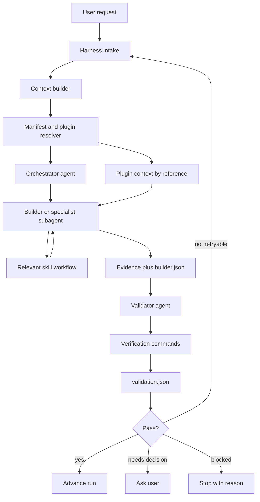

# Plan: SDLC RStack Harness Architecture Refactor

## Status recap

This document rewrites the earlier architecture refactor plan for `/Users/richardsongunde/projects/SDLC-rstack` and adds the Harness model requested by Richardson.

### Evidence captured in this run

- Existing plan inspected: `/Users/richardsongunde/projects/SDLC-rstack/specs/sdlc-rstack-architecture-refactor.md`, 413 lines before rewrite.
- Backup of previous plan: `.rstack/runs/2026-05-18T02-09-21-425Z-rewrite-sdlc-rstack-architecture-refactor-plan-to-recap-prior-wo/artifacts/original-sdlc-rstack-architecture-refactor.md`.
- Transcript extracted from: `https://www.youtube.com/watch?v=C_GG5g38vLU`.
- Video title from YouTube oEmbed: `Harnesses in AI: A Deep Dive - Tejas Kumar, IBM`.
- Transcript artifact: `.rstack/runs/2026-05-18T02-09-21-425Z-rewrite-sdlc-rstack-architecture-refactor-plan-to-recap-prior-wo/artifacts/transcripts/C_GG5g38vLU.transcript.txt`.
- Transcript extraction evidence: 621 caption segments, 22,029 characters, extracted with `youtube-transcript-api 1.2.4` in a temporary venv.

### What was already planned

The previous plan already made the right core move: stop treating agents, skills, and plugins as interchangeable content buckets.

It proposed three clean layers:

1. `agents/` - who does the task. These are personas with role, voice, trigger rules, model/tool policy, and accountability.
2. `skills/` - how to do the task. These are reusable workflows with trigger and do-not-trigger rules.
3. `plugins/` - what domain pack is installed. These are bundles that should reference canonical agents and skills instead of copying them.

It also planned:

- Deduplicating thin specialist agents that are shadowed by richer plugin agents.
- Flattening and consolidating duplicate skill packs.
- Merging overlapping plugins such as observability, security, documentation, and testing variants.
- Adding a root `manifest.json` as a harness-neutral discovery endpoint.
- Moving plugins to a `plugin.json` v2 schema with `agents[]` and `skills[]` references.
- Enforcing the owner byline `RStack developed by Richardson Gunde` through validation.
- Updating `extensions/rstack-sdlc.ts` so Pi reads the manifest, resolves plugin refs, deduplicates registry selection, and exposes package skills through `resources_discover`.
- Cutting a clean `2.0.0` release after validation.

That plan answered the packaging and duplication problem. It did not yet make the execution model explicit. This rewrite adds that missing Harness layer.

## Transcript summary: what Harness means here

The video frames a harness as reliability infrastructure around a black-box model. The key points from the extracted transcript are:

1. The reason to use a harness is reliability. Models, token budgets, context windows, and provider behavior are variables we do not fully control.
2. An agent harness is everything around the model that grounds it in reality and ties it to a stable environment.
3. A harness is not just the agent loop. It is the stuff around the loop, and it can even be a loop around the loop.
4. Common harness parts include:
   - Tool registry.
   - Model/runtime selection.
   - Context management and compaction.
   - Guardrails such as max steps and max messages.
   - Agent loop control.
   - Verification after the agent claims it is done.
5. The demo failure is important: a browser agent clicks an upvote button, hits a login screen, and still claims success. The fix is not to prompt harder. The fix is harness logic: logging, history, guardrails, retries, and deterministic verification.
6. The implementation style is ordinary engineering: create a session, create tools, create context, run the loop, record history, verify the outcome.

For SDLC-rstack, this means the harness must not trust agent prose. It must require artifacts, contracts, commands, and validator evidence.

## Recommendation: how to use agents, subagents, skills, and plugins

Use all of them, but give each one one job.

| Layer | Purpose | Owns | Does not own |
|---|---|---|---|
| Harness | Runtime reliability | Run state, tool registry, context, guardrails, retries, evidence, validation gates | Domain persona or copied workflows |
| Agent | Main executor persona | Role, voice, authority, trigger rules, allowed tools | Generic workflow library |
| Subagent | Scoped specialist invocation | One bounded task or review | Global orchestration decisions |
| Skill | Reusable workflow | Step-by-step method, safety checks, trigger and do-not-trigger guidance | Agent identity or package bundle |
| Plugin | Installable domain bundle | References to canonical agents, skills, commands, templates | Inline copies of agents or skills |

The best operating model is:

1. Harness receives the user request and creates a run.
2. Harness resolves the manifest and plugin refs.
3. Orchestrator selects the right agent or subagent.
4. Builder or specialist loads the relevant skill before execution.
5. Plugin context is included only as a bounded domain accelerator.
6. Builder writes `builder.json` with evidence.
7. Validator reads files, runs checks, writes `validation.json`.
8. Harness advances, retries, blocks, or asks the user based on proof.

Short answer to the original question: subagents should execute with skills, and plugins should package/discover related agents and skills. The harness coordinates them and prevents duplicate selection.

## Target architecture

```text
┌─────────────────────────────────────────────────────────────┐
│ harness/                                                     │
│ Runtime reliability layer                                    │
│ - run lifecycle                                              │
│ - tool registry                                              │
│ - context manager                                            │
│ - guardrails                                                 │
│ - retry policy                                               │
│ - evidence ledger                                            │
│ - builder and validator contract gates                       │
└─────────────────────────────────────────────────────────────┘
┌─────────────────────────────────────────────────────────────┐
│ agents/                                                      │
│ Who does the work                                             │
│ - core/orchestrator.md                                       │
│ - core/builder.md                                            │
│ - core/validator.md                                          │
│ - sdlc/00..14 pipeline agents                                │
│ - curated specialists                                        │
└─────────────────────────────────────────────────────────────┘
┌─────────────────────────────────────────────────────────────┐
│ skills/                                                      │
│ How work is done                                              │
│ - flat reusable workflows                                     │
│ - explicit trigger and do-not-trigger guidance                │
│ - safety and validation steps                                 │
└─────────────────────────────────────────────────────────────┘
┌─────────────────────────────────────────────────────────────┐
│ plugins/                                                     │
│ Domain bundles                                                │
│ - plugin.json v2                                              │
│ - references to top-level agents and skills                   │
│ - plugin-specific commands and templates only                 │
└─────────────────────────────────────────────────────────────┘
```

## Harness runtime flow



## Harness components to implement

### 1. Run lifecycle manager

Add a package-local runtime contract that standardizes run directories:

```text
.rstack/runs/<run_id>/
  manifest.json
  context.md
  plan.md
  tasks.json
  events.jsonl
  artifacts/
  tasks/<task_id>/
    prompt.md
    builder.json
    validation.json
```

The existing RStack operating standard already uses this shape. The implementation should make it first-class in SDLC-rstack instead of relying on convention.

### 2. Tool registry

The harness decides which tools each agent or subagent receives.

Minimum interface:

```ts
interface HarnessTool {
  name: string;
  description: string;
  parameters: unknown;
  execute: (...args: unknown[]) => Promise<unknown>;
}
```

Initial tool policies:

- Orchestrator: read state, plan, delegate, inspect registry.
- Builder: read, write, edit, bash, and selected specialist tools.
- Validator: read-only by default, plus safe verification commands.
- Security validator: read-only plus approved scan commands.
- Release/deploy agents: require explicit user approval before publish, push, delete, or deploy.

### 3. Context manager

The harness owns context, not the agent.

Responsibilities:

- Keep `context.md` current.
- Link large evidence files instead of pasting them into prompts.
- Summarize transcript and plan evidence.
- Compact long histories into source-linked summaries.
- Pass only task-relevant context into each subagent.

This maps directly to the transcript point that harnesses manage context and compact it when needed.

### 4. Guardrail engine

Start with deterministic guardrails:

```ts
interface HarnessGuardrails {
  maxTaskAttempts: number;
  maxToolCallsPerTask: number;
  maxMessagesPerTask: number;
  requireBuilderContract: boolean;
  requireValidatorContract: boolean;
  requireTranscriptEvidenceForVideoClaims: boolean;
  requireUserApprovalForDestructiveActions: boolean;
}
```

Default policy:

- `maxTaskAttempts`: 2 for normal builders, 1 for destructive or release tasks.
- `maxToolCallsPerTask`: task-dependent, recorded in prompt.
- `requireBuilderContract`: true.
- `requireValidatorContract`: true.
- `requireTranscriptEvidenceForVideoClaims`: true.
- `requireUserApprovalForDestructiveActions`: true.

### 5. Evidence ledger

Append every meaningful event to `events.jsonl`:

```json
{"task_id":"004-implementation","kind":"file_write","path":"specs/sdlc-rstack-architecture-refactor.md","status":"PASS"}
{"task_id":"004-implementation","kind":"command","command":"grep -n Harness specs/sdlc-rstack-architecture-refactor.md","status":"PASS"}
```

The ledger is the harness answer to the transcript's false-success problem. If there is no evidence, the harness should not advance.

### 6. Validator gate

Every builder task must end with:

```json
{
  "task_id": "string",
  "agent": "string",
  "status": "PASS|FAIL|BLOCKED|DONE_WITH_CONCERNS",
  "summary": "string",
  "files_modified": [],
  "tests_run": [],
  "risks": [],
  "next_steps": []
}
```

Every validator task must end with:

```json
{
  "task_id": "string",
  "validator": "string",
  "status": "PASS|FAIL",
  "checks": [
    {"name": "string", "status": "PASS|FAIL", "evidence": "string"}
  ],
  "issues": [],
  "retry_recommendation": "none|retry_builder|ask_user|block"
}
```

A builder summary is not enough. The validator must read files, check acceptance criteria, and run verification commands when applicable.

### 7. Manifest and reference resolver

Keep the previous plan's `manifest.json` and `plugin.json` v2 approach.

Root manifest entries:

```json
{
  "name": "backend-development",
  "kind": "plugin",
  "path": "plugins/backend-development/plugin.json",
  "domains": ["backend", "api"],
  "owner": "RStack developed by Richardson Gunde",
  "description": "Backend API design and implementation bundle"
}
```

Plugin v2 example:

```json
{
  "name": "backend-development",
  "version": "2.0.0",
  "description": "Backend API design, GraphQL architecture, workflow orchestration, and TDD",
  "agents": ["backend-architect", "api-designer", "graphql-architect", "test-automator"],
  "skills": ["api-design-principles", "rest-best-practices", "tdd-workflows"],
  "commands": ["./commands/feature-development.md"],
  "templates": ["./templates/fastapi-skeleton.py"],
  "author": {"name": "Richardson Gunde"},
  "license": "MIT",
  "owner": "RStack developed by Richardson Gunde"
}
```

Reference rule: plugins may reference agents and skills, but may not contain duplicate `agents/` or `skills/` subdirectories after migration.

## Updated implementation phases

### Phase 0: Evidence and baseline

Purpose: make the refactor measurable before moving files.

Tasks:

- Snapshot current counts for agents, skills, plugins, files, and package size.
- Extract and store the Harness transcript summary.
- Preserve the previous architecture plan as a run artifact.
- Confirm current validation and test commands.

Exit criteria:

- Baseline report exists.
- Transcript artifact exists.
- Previous plan backup exists.
- No source files moved or deleted.

### Phase 1: Harness contract foundation

Purpose: make reliability explicit before deduplication.

Tasks:

- Add `docs/HARNESS.md` describing the runtime model.
- Add or formalize types for run state, task state, builder contract, validator contract, guardrails, and evidence events.
- Make `events.jsonl` a required run artifact.
- Add validation checks that fail when required contracts are missing.
- Add transcript-evidence policy for video-derived planning claims.

Exit criteria:

- Harness docs exist.
- Contract validation fails on missing builder or validator contracts.
- No destructive package restructuring yet.

### Phase 2: Registry and manifest foundation

Purpose: give every harness one discovery path.

Tasks:

- Add root `manifest.json` generation.
- Add `schemas/agent.schema.json`.
- Add `schemas/skill.schema.json`.
- Add `schemas/plugin.schema.json` for plugin v2.
- Add resolver tests for agent and skill refs.
- Extend `bin/rstack-agents.js validate` to check schema, owner byline, and refs.

Exit criteria:

- `npm run build:manifest` works.
- `npm run validate` reports unresolved refs and branding drift.
- Manifest lists every canonical artifact.

### Phase 3: Inventory and dedup decisions

Purpose: decide what to keep before deleting anything.

Tasks:

- Walk `agents/**`, `skills/**`, and `plugins/*/plugin.json`.
- Classify every artifact as `keep`, `rewrite`, `merge_into:<target>`, or `delete`.
- Identify thin specialist agents.
- Identify duplicate skills.
- Identify overlapping plugin clusters.
- Write `specs/inventory.json`.
- Write `specs/branding-audit.md`.

Exit criteria:

- Inventory covers all current artifacts.
- Every merge/delete has a target or reason.
- User approval is required before destructive migration.

### Phase 4: Agents layer refactor

Purpose: make agents real personas, not placeholder descriptions.

Tasks:

- Rewrite kept specialists using `agents/core/orchestrator.md` as quality reference.
- Merge model-tier duplicates into one canonical agent where appropriate.
- Preserve or add owner byline.
- Remove unsalvageable thin agents only after inventory approval.

Exit criteria:

- Target: about 80 curated specialists plus core and SDLC agents.
- Every kept agent has meaningful body content and trigger rules.
- Agent schema validation passes.

### Phase 5: Skills layer refactor

Purpose: make skills the canonical workflow library.

Tasks:

- Flatten nested skill directories.
- Merge duplicate workflows.
- Add explicit trigger and do-not-trigger prose.
- Keep skills independent from plugin-local copies.

Exit criteria:

- Target: about 35 flat skills.
- No depth-2 `SKILL.md` files remain.
- Skill schema validation passes.

### Phase 6: Plugins layer refactor

Purpose: make plugins installable bundles, not duplicate content homes.

Tasks:

- Convert each `plugin.json` to v2.
- Replace inline plugin agents and skills with top-level references.
- Keep plugin-specific commands and templates.
- Merge overlapping plugin themes.

Exit criteria:

- Target: about 28 plugins.
- No `plugins/*/agents/` or `plugins/*/skills/` subdirectories remain.
- Every plugin ref resolves.

### Phase 7: Pi extension and harness integration

Purpose: make the runtime use the cleaned architecture.

Tasks for `extensions/rstack-sdlc.ts`:

- `loadRegistry()` reads root `manifest.json` first, directory scan second.
- `pluginPackContext()` resolves plugin refs to canonical top-level agents and skills.
- `selectRegistry()` deduplicates plugin-covered agents and skills.
- `resources_discover` returns package skills and project-local overrides.
- Task prompts include harness guardrails and required contract paths.
- Validator tasks are read-only unless explicitly approved.

Exit criteria:

- Pi sees package skills through resources.
- Selecting a plugin does not double-count referenced agents or skills.
- Builder and validator contract paths are included in task prompts.

### Phase 8: Validation, docs, and release

Purpose: ship the new architecture only after proof.

Tasks:

- Update tests:
  - `validate-extension.test.js` for plugin v2 and no inline plugin agents/skills.
  - `validate-references.test.js` for manifest and plugin refs.
  - `validate-markdown-frontmatter.test.js` for exact owner byline.
  - `validate-manifest.test.js` for full artifact listing.
  - Harness contract tests for missing `builder.json` and `validation.json`.
- Update docs:
  - `docs/ARCHITECTURE.md`.
  - `docs/HARNESS.md`.
  - `docs/MIGRATING-FROM-V1.md`.
  - `README.md`.
  - `AGENTS.md`.
  - `CHANGELOG.md`.
- Bump `VERSION` and `package.json` to `2.0.0` only after tests pass.
- Require user OTP for `npm publish`.

Exit criteria:

- `npm test` passes.
- `npm run validate` passes.
- `npm run build:manifest` is idempotent.
- `npm publish --dry-run` shows expected package contents and reduced weight.
- User approves publish.

## Acceptance criteria

### Harness layer

- Run lifecycle is documented and enforced.
- Builder and validator contracts are required.
- Evidence ledger exists.
- Guardrails include max attempts, max tool calls, max messages, contract checks, and destructive-action approval.
- Validators cannot PASS without evidence.

### Agents layer

- Core agents remain: orchestrator, builder, validator.
- SDLC pipeline agents remain: `00` through `14`.
- Specialists are curated and meaningful.
- Thin placeholder agents are rewritten, merged, or removed.
- Every agent has `owner: RStack developed by Richardson Gunde`.

### Skills layer

- Skills are flat.
- Duplicate skill packs are merged.
- Each skill has trigger and do-not-trigger guidance.
- Every skill has `owner: RStack developed by Richardson Gunde`.

### Plugins layer

- Plugins use v2 reference schema.
- Plugins do not contain copied agents or skills.
- Plugin refs resolve to top-level artifacts.
- Every plugin has `"owner": "RStack developed by Richardson Gunde"`.

### Extension layer

- Pi extension reads manifest first.
- Package skills are exposed through `resources_discover`.
- Registry selection deduplicates plugin-covered refs.
- Task prompts include harness guardrails and output contracts.

## Validation commands

Run these in order during implementation:

```bash
cd /Users/richardsongunde/projects/SDLC-rstack
node --version
npm install
npm run build:manifest
npm run validate
npm test
node -e "const m=require('./manifest.json'); console.log('agents:',m.agents.length,'skills:',m.skills.length,'plugins:',m.plugins.length)"
grep -rL "owner: RStack developed by Richardson Gunde" agents skills prompts | grep -E '\.md$' || true
grep -L '"owner": "RStack developed by Richardson Gunde"' plugins/*/plugin.json || true
find plugins -type d \( -name agents -o -name skills \) | wc -l
find skills -mindepth 2 -name SKILL.md | wc -l
npm publish --dry-run
git status --short
```

Expected final state:

- Branding checks return no missing files.
- Plugin inline agents/skills count is `0`.
- Nested skill count is `0`.
- Tests pass.
- Manifest counts are within target ranges.

## Risks and mitigations

| Risk | Impact | Mitigation |
|---|---|---|
| Harness scope becomes too broad | Refactor stalls | Phase 1 only formalizes contracts and evidence before runtime code grows |
| Deleting duplicates loses useful content | Capability regression | Inventory must map every delete to a merge target or reason |
| Plugins and skills stay ambiguous | Routing remains noisy | Plugins must reference canonical skills, not copy them |
| Agent claims success without proof | False DONE | Harness requires deterministic validator evidence |
| Branding drifts again | User requirement violated | Exact owner byline is a hard validation gate |
| Publish happens before validation | Broken npm package | Release phase requires test, validate, dry-run, and user OTP gate |

## Immediate next steps

1. Treat this rewritten spec as the source of truth for the refactor.
2. Run Phase 0 baseline commands and write `specs/baseline-report.md`.
3. Implement Phase 1 Harness contracts before moving agents, skills, or plugins.
4. Only after contract validation exists, start inventory and dedup migration.

## Bottom line

The previous plan solved the content architecture. This rewrite adds the runtime architecture.

Agents and subagents are the workers. Skills are the work instructions. Plugins are installable bundles. The harness is the reliability system around them: tools, context, guardrails, retries, evidence, and validation.
